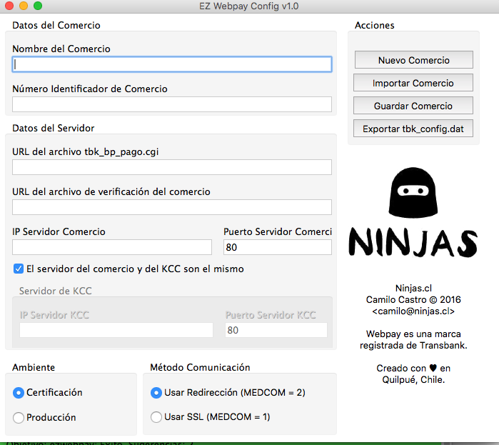

# EZ Webpay Configurator
Es una interfaz gráfica para configurar el archivo *tbk_config.dat* del KCC de Transbank.
Pensado para ayudar a los desarrolladores. 

Un software creado por
http://www.ninjas.cl

## Licencia
Software bajo la GPL v3. Ver archivo [LICENCE](LICENSE).

## Changelog (dd-mm-yyyy)

### v1.0 01-05-2016
- Primera Versión

## Ayuda
https://github.com/clsource/guia-webpay

## Descargas
- [Linux 32 bit](builds/Linux32/)
- [OSX 64 bit](builds/OSX64/)
- [Windows 64 bit](builds/Windows64/)

## Agradecimientos
- Programado en Object Pascal con http://lazarus-ide.org
- Ícono de Aplicación por http://publicicons.org
